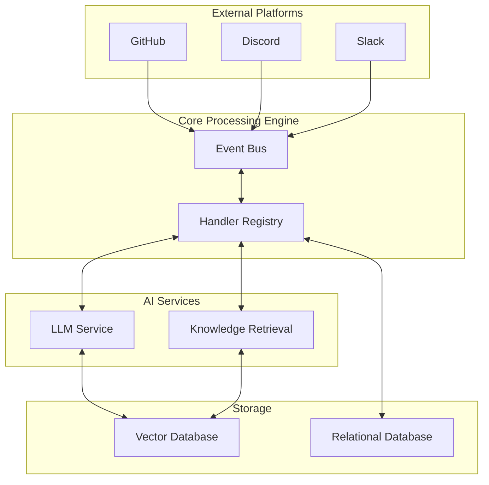

# Devr.AI - AI-Powered Developer Relations Assistant

Welcome to the documentation for Devr.AI, an advanced AI-powered Developer Relations (DevRel) assistant designed to revolutionize open-source community management.

## Project Overview

Devr.AI integrates with platforms like Discord, Slack, GitHub, and Discourse to function as a virtual DevRel advocate that helps maintainers engage with contributors, streamline onboarding processes, and deliver real-time project updates.

The system leverages Large Language Models (LLMs), knowledge retrieval mechanisms, and workflow automation to enhance community engagement, simplify contributor onboarding, and ensure that open-source projects remain active and well-supported.

## Key Features

### Event-Based Architecture

-   **Centralized Event Bus**: A robust event processing system that handles events from various platforms
-   **Extensible Handler Registry**: Easy-to-extend handler system for processing different event types
-   **Platform Adapters**: Specialized adapters for GitHub, Discord, Slack, and other platforms

### GitHub Integration

-   **Webhook Event Capture**: Capturing and processing GitHub events (issues, PRs, comments)
-   **Automated Triage**: Intelligent issue and PR triage based on content and context
-   **Contributor Recognition**: Automatic detection and welcome for new contributors

### Discord Interaction

-   **GitHub Notifications**: Real-time notifications in Discord for important GitHub events
-   **Command-Based Interaction**: Rich command system for project management from Discord
-   **User Onboarding**: Guided onboarding experience for new community members

### Knowledge Management

-   **RAG-Based FAQ System**: Retrieval-Augmented Generation for answering common questions
-   **Project-Specific Knowledge**: Contextual understanding of your specific project
-   **Self-Updating Documentation**: Documentation suggestions based on common questions

## Getting Started

To get started with Devr.AI, check out our [Installation Guide](./INSTALL_GUIDE.md) which will walk you through setting up the project locally.

## System Architecture

Devr.AI follows a modular, event-driven architecture that makes it easy to extend and customize.

Architecture for this demo:

## Demo Features

This demo includes the following core functionalities:

-   Basic Event Bus: A centralized event processing system
-   GitHub Event Handling: Capture and route GitHub webhook events
-   Discord Notifications: Send GitHub event notifications to Discord
-   RAG-Based Q&A: Answer common questions using Retrieval-Augmented Generation
-   Documentation System: This MkDocs documentation hosted on GitHub Pages
